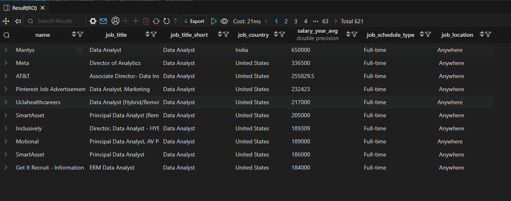

# 💼 Top Paying Jobs — Job Data Analysis (SQL)

**Project:** Job Data Analysis (SQL)  
**Objective:** Identify the companies offering the highest average annual salaries for Data Analyst roles.

---

## 🧾 SQL Query
```sql
SELECT 
    name,
    job_title,
    job_title_short,
    job_country,
    salary_year_avg,
    job_schedule_type,
    job_location
FROM 
    job_postings_fact
WHERE 
    job_title_short = 'Data Analyst'
    AND salary_year_avg IS NOT NULL
ORDER BY 
    salary_year_avg DESC
LIMIT 10;
```
---
## 📸 Result Preview

Here’s the output of the above query:



---

## 💡 Insights

- **Mantys (India)** offers the **highest average salary** for a Data Analyst at **$650,000**, far above other companies.  
- **Top-paying U.S. companies** include **Meta**, **AT&T**, and **Pinterest**, offering salaries between **$230K–$330K**.  
- Most roles are **Full-time** and **Remote/Hybrid**, showing flexibility even for high-salary positions.  
- **Director** and **Principal** titles are common — higher seniority clearly correlates with higher pay.  
- **U.S. companies dominate** top-paying roles, but **India’s Mantys** appears as an outlier with an exceptionally high figure (possibly due to reporting or conversion differences).  

📈 *Overall Insight:*  
Senior-level data roles (Directors, Principals) pay the most, often offering flexibility and leadership responsibilities. These jobs mix management with deep analytical expertise.
---

📂 Folder Structure
```
/SQL_Projects
 ├── 1.Top_Paying_Jobs
 │    ├── 1_result.png
 │    ├── top_paying_jobs.sql
 │    └── README.md
```

---
**📌 Author:** Utkarsh Naik  
**📈 Project Type:** SQL-based Job Market Analysis

