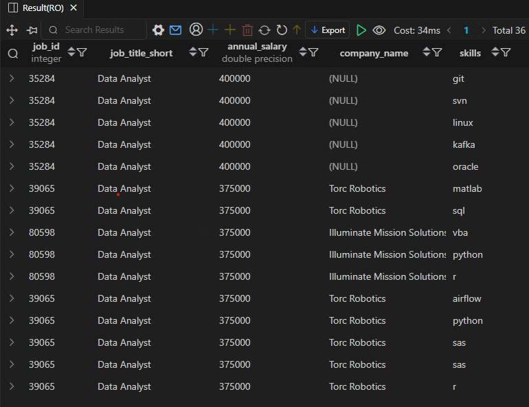

# 💼 Top Paying Job Skills — Job Data Analysis (SQL)

**Project: Job Data Analysis (SQL)**  
**Objective: Identify which technical skills are most commonly associated with the highest-paying Data Analyst positions.**

---
🧾 SQL Query
```
WITH top_paying_jobs AS (
    SELECT
        job_id,
        job_title_short,
        job_postings_fact.salary_year_avg annual_salary,
        company_dim.name company_name
    FROM 
        job_postings_fact
    LEFT JOIN company_dim ON job_postings_fact.company_id = company_dim.company_id
    WHERE 
        salary_year_avg IS NOT NULL
        AND job_title_short = 'Data Analyst'
    ORDER BY 
        salary_year_avg DESC
    LIMIT 10
)
SELECT 
    top_paying_jobs.*,
    skills_dim.skills
FROM 
    top_paying_jobs
INNER JOIN 
    skills_job_dim ON top_paying_jobs.job_id = skills_job_dim.job_id
INNER JOIN 
    skills_dim ON skills_job_dim.skill_id = skills_dim.skill_id
ORDER BY 
    annual_salary DESC;
```
## 📸 Result Preview

Here’s the output of the above query:


--- 

## 💡 Insights

- The highest-paying Data Analyst roles offer salaries up to $400,000 per year, primarily for candidates with strong technical and analytical backgrounds.

- Top skills across these listings include Git, Linux, Kafka, Oracle, and SVN, showing a preference for data engineering and version control knowledge.

- Torc Robotics and Illuminate Mission Solutions appear frequently, offering around $375K/year, emphasizing skills such as Python, R, SQL, Airflow, and VBA.

- Some listings have no company name (NULL) — likely recruiter or confidential postings.

- Roles demanding automation, cloud, and programming skills consistently rank among the highest-paid.
---

## 📈 Overall Insight:
- The mix of programming (Python, R) and data pipeline tools (Airflow, Kafka, Git) significantly increases earning potential for Data Analysts.
- These skills align more closely with data engineering roles, creating a hybrid analyst-engineer profile.
---

📂 Folder Structure
```
/SQL_Projects
 ├── 2.Top_Paying_Job_Skills
 │    ├── 2_result.png
 │    ├── 2_top_paying_job_skills.sql
 │    └── README.md
```
📌 Author: Utkarsh Naik  
📈 Project Type: SQL-based Job Market Analysis