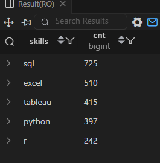

# 💼 Top Demand Skills — Job Data Analysis (SQL)

**Project: Job Data Analysis (SQL)**  
**Objective: Identify the most frequently requested technical skills for Data Analyst positions.**

---

🧾 **SQL Query**
```sql
WITH remote_job AS(
SELECT skill_id,
    COUNT(*) AS cnt
FROM skills_job_dim
INNER JOIN job_postings_fact ON skills_job_dim.job_id=job_postings_fact.job_id
WHERE job_postings_fact.job_work_from_home= 1 AND
    job_postings_fact.job_title_short='Data Analyst'
GROUP BY skill_id)
SELECT
    skills_dim.skills,
    cnt
FROM remote_job
INNER JOIN skills_dim ON remote_job.skill_id=skills_dim.skill_id
ORDER BY cnt DESC
LIMIT 5

/*OR*/

SELECT skills,
    COUNT(*) AS demand_count
FROM job_postings_fact
INNER JOIN skills_job_dim ON job_postings_fact.job_id=skills_job_dim.job_id
INNER JOIN skills_dim ON skills_job_dim.skill_id=skills_dim.skill_id
WHERE job_title_short='Data Analyst' AND job_work_from_home=1
GROUP BY skills
ORDER BY demand_count DESC
LIMIT 5
```
## 📸 **Result Preview**

Here’s the output of the above query:



---

## 💡 **Insights**

- The most in-demand skill for Data Analysts is **SQL**, appearing in **725 job postings**, confirming its core importance in analytics.  
- **Excel** remains a crucial tool, listed in **510 job postings**, highlighting that spreadsheet analysis still plays a major role.  
- **Tableau** ranks third (**415 postings**) — visualization expertise continues to be valuable for data storytelling.  
- **Python** is listed in **397 postings**, reinforcing its status as a leading programming language in analytics.  
- **R** appears in **242 postings**, often used in statistical and academic analysis contexts.  

---

## 📈 **Overall Insight**

- SQL remains the foundation for most data analyst roles — employers expect it across all sectors.  
- The combination of **SQL + Python + Tableau** provides both analytical and technical strength.  
- Mastering these three ensures competitiveness in the data analytics job market.  

---
📂 Folder Structure
```
/SQL_Projects
 ├── 3.Top_Demand_Skills
 │    ├── 3_result.png
 │    ├── 3_top_demand_skills.sql
 │    └── README.md

```
📌 Author: Utkarsh Naik  
📈 Project Type: SQL-based Job Market Analysis
