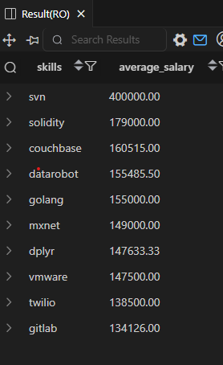

# 💼 Top Paying Skills — Job Data Analysis (SQL)

**Project: Job Data Analysis (SQL)**  
**Objective: Identify which technical skills are associated with the highest average salaries for Data Analyst positions.**

---

🧾 **SQL Query**
```sql
SELECT
    skills_dim.skills,
    ROUND(AVG(job_postings_fact.salary_year_avg), 2) AS average_salary
FROM 
    job_postings_fact
INNER JOIN 
    skills_job_dim ON job_postings_fact.job_id = skills_job_dim.job_id
INNER JOIN 
    skills_dim ON skills_job_dim.skill_id = skills_dim.skill_id
WHERE 
    job_postings_fact.job_title_short = 'Data Analyst'
    AND job_postings_fact.salary_year_avg IS NOT NULL
GROUP BY 
    skills_dim.skills
ORDER BY 
    average_salary DESC
LIMIT 10;
```
## 📸 **Result Preview**

Here’s the output of the above query:



---

## 💡 **Insights**

- **SVN** stands out with an exceptionally high average salary of **$400,000**, likely due to niche or senior-level postings requiring version control expertise.  
- **Solidity** ranks second at **$179,000**, highlighting the strong pay for **blockchain and smart contract** development skills.  
- **Couchbase** and **DataRobot** both offer salaries around **$155K–$160K**, showing demand for **database** and **AI/automation** technologies.  
- **Go (Golang)** and **MxNet** also appear among high-paying skills, linking backend and deep learning capabilities to better pay.  
- Traditional data tools like **dplyr** and **GitLab** still command strong salaries, especially when combined with automation and cloud experience.  

---

## 📈 **Overall Insight**

- Specialized or emerging technologies like **Solidity, Couchbase, and Go** drive the highest compensation in the analytics field.  
- Roles demanding **automation, AI frameworks, and version control** knowledge tend to pay significantly more.  
- Developing a mix of **data + cloud + DevOps** skills can greatly increase earning potential for analysts transitioning toward data engineering or MLOps.  
---
📂 Folder Structure
```
/SQL_Projects
 ├── 4.Top_Paying_Skills
 │    ├── 4_result.png
 │    ├── 4_top_paying_skills.sql
 │    └── README.md

```
📌 Author: Utkarsh Naik  
📈 Project Type: SQL-based Job Market Analysis