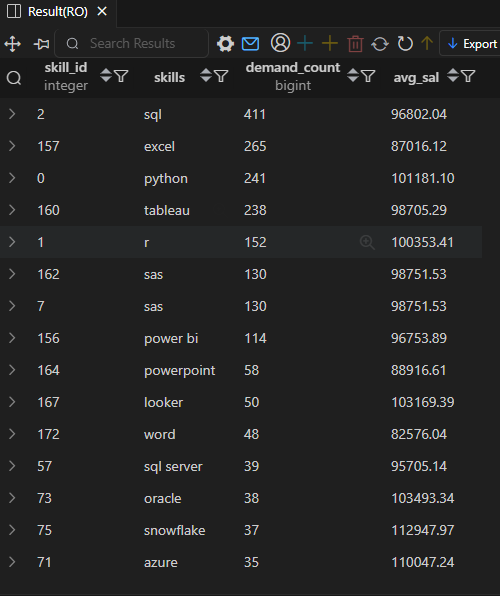

# 💼 Most Optimal Skills — Job Data Analysis (SQL)

**Project: Job Data Analysis (SQL)**  
**Objective:** Identify the most optimal skills for Data Analysts — the ones that balance both high demand and high average salary.  

---

🧾 **SQL Query**
```sql
WITH skills_demand AS(
SELECT
    skills_dim.skill_id,
    skills_dim.skills,
    COUNT(skills_job_dim.job_id) AS demand_count
FROM job_postings_fact
INNER JOIN skills_job_dim ON job_postings_fact.job_id=skills_job_dim.job_id
INNER JOIN skills_dim ON skills_job_dim.skill_id=skills_dim.skill_id
WHERE job_title_short='Data Analyst' AND job_work_from_home=1 AND salary_year_avg IS NOT NULL
GROUP BY skills_dim.skill_id,skills_dim.skills
),  avg_sal AS(
    SELECT 
        skills_job_dim.skill_id,
        ROUND(AVG(salary_year_avg::NUMERIC),2) AS avg_sal
FROM job_postings_fact
INNER JOIN skills_job_dim ON job_postings_fact.job_id=skills_job_dim.job_id
INNER JOIN skills_dim ON skills_job_dim.skill_id=skills_dim.skill_id
WHERE job_title_short='Data Analyst' AND salary_year_avg IS NOT NULL AND job_work_from_home=1
GROUP BY skills_job_dim.skill_id
)
SELECT skills_demand.skill_id,
    skills_demand.skills,
    demand_count,
    avg_sal
FROM skills_demand
INNER JOIN avg_sal ON skills_demand.skill_id=avg_sal.skill_id
WHERE demand_count>10
ORDER BY demand_count DESC,
        avg_sal DESC

```
---
## 📸 **Result Preview**

Here’s the output of the above query:



---

## 💡 **Insights**

- **SQL** leads in overall demand with **411 job postings**, proving it’s still the backbone skill for data roles.  
- **Python** stands out as a top-paying and highly demanded skill (**$101K avg salary, 241 postings**).  
- **R**, **Tableau**, and **Power BI** show strong balance — combining visualization and analytics value.  
- Cloud and modern tools like **Snowflake ($112K)** and **Azure ($110K)** command high pay but appear less frequently, indicating they’re specialized, high-value skills.  
- Legacy yet reliable tools such as **Excel** and **PowerPoint** still appear in listings, though with lower salary ranges.  

---

## 📈 **Overall Insight**

- **Best Overall Skills to Learn:** SQL, Python, and Tableau — these consistently appear across high-salary and high-demand roles.  
- **High-Value Additions:** Cloud and BI tools like Snowflake, Azure, and Looker significantly increase earning potential.  
- A combination of **data handling (SQL, Python)** + **reporting (Tableau, Power BI)** + **cloud integration (Azure, Snowflake)** makes for an optimal, future-proof skill set.  

---

📂 Folder Structure
```
/SQL_Projects
 ├── 5.Most_Optimal_Skills
 │    ├── 5_result.png
 │    ├── 5_optimal_skills.sql
 │    └── README.md

```
---

📌 Author: Utkarsh Naik  
📈 Project Type: SQL-based Job Market Analysis