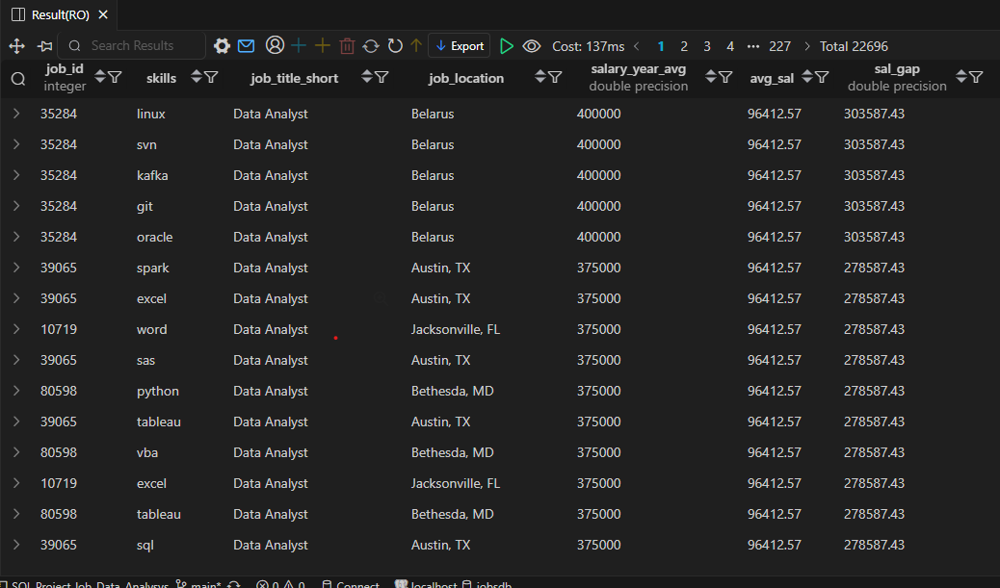

# 💼 Salary Comparison with Average — Job Data Analysis (SQL)

**Project:** Job Data Analysis (SQL)  
**Objective:** For Data Analyst job postings, show the salary along with the average salary for that role, and also calculate the difference between the two.

---

🧾 **SQL Query**
```sql
SELECT 
    skills_job_dim.job_id,
    skills_dim.skills,
    job_title_short,
    job_location,
    salary_year_avg,
    ROUND(CAST(AVG(salary_year_avg) OVER(PARTITION BY job_title_short)AS NUMERIC),2) AS avg_sal,
    salary_year_avg-ROUND(CAST(AVG(salary_year_avg) OVER(PARTITION BY job_title_short)AS NUMERIC),2) AS sal_gap
FROM job_postings_fact
LEFT JOIN skills_job_dim ON job_postings_fact.job_id=skills_job_dim.job_id
LEFT JOIN skills_dim ON skills_job_dim.skill_id=skills_dim.skill_id
WHERE job_title_short='Data Analyst' AND salary_year_avg IS NOT NULL AND skills_dim.skills IS NOT NULL
ORDER BY salary_year_avg DESC

```
## 📸 **Result Preview**

Here’s the output of the above query:



---

## 💡 **Insights**

- **Top-paying job postings** for Data Analysts reach up to **$400,000/year** — primarily located in **Belarus** with strong technical skill requirements (Linux, Git, Kafka, Oracle, SVN).  
- Roles in **Austin, TX** and **Bethesda, MD** offer competitive salaries around **$375K**, with key skills including **Python, Tableau, SQL, SAS, and Airflow**.  
- The **average Data Analyst salary** across all postings is approximately **$96,412**, meaning top roles exceed this by more than **$278K–$300K**.  
- The salary gap highlights how **advanced data tools** and **location** heavily influence compensation.  
- **High-skill combinations** (Python + SQL + Tableau) tend to appear repeatedly in roles paying well above the average.  

---

## 📈 **Overall Insight**

- Data Analysts with **engineering or automation-focused skills** (e.g., Kafka, Airflow, Git) consistently earn well above average.  
- **Geographic impact:** U.S. tech hubs and select European countries like Belarus offer top-tier pay.  
- Building a strong technical toolkit that bridges **analytics, data pipelines, and cloud** technologies significantly boosts earning potential.  

 ---

📂 Folder Structure
```
/SQL_Projects
 ├── 6.Salary_Comparison_with_Average
 │    ├── 6_result.png
 │    ├── 6_Compare_Salary_with_Average_Salary_for_Data_Analyst.sql
 │    └── README.md

```

📌 Author: Utkarsh Naik  
📈 Project Type: SQL-based Job Market Analysis