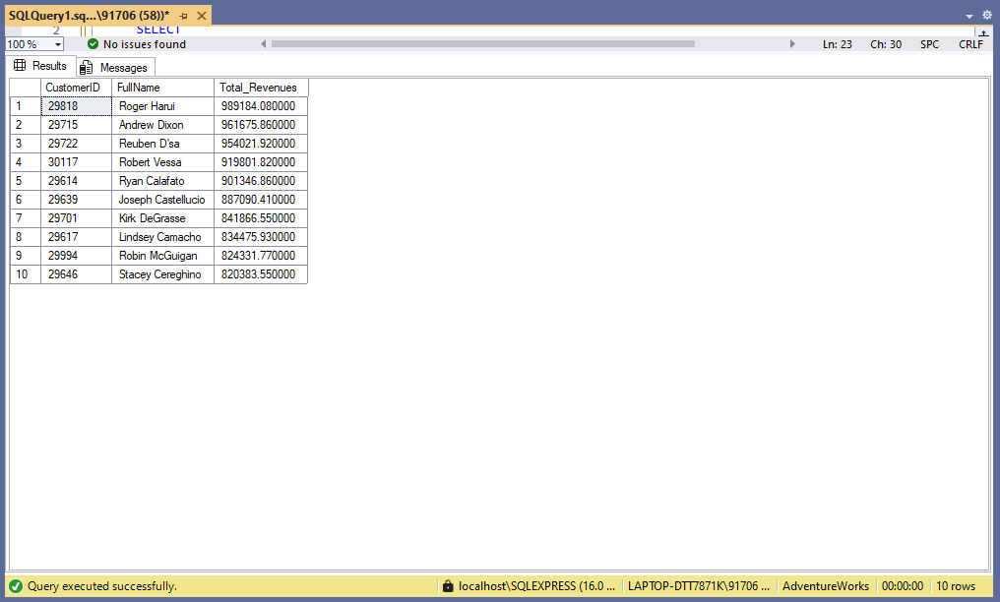
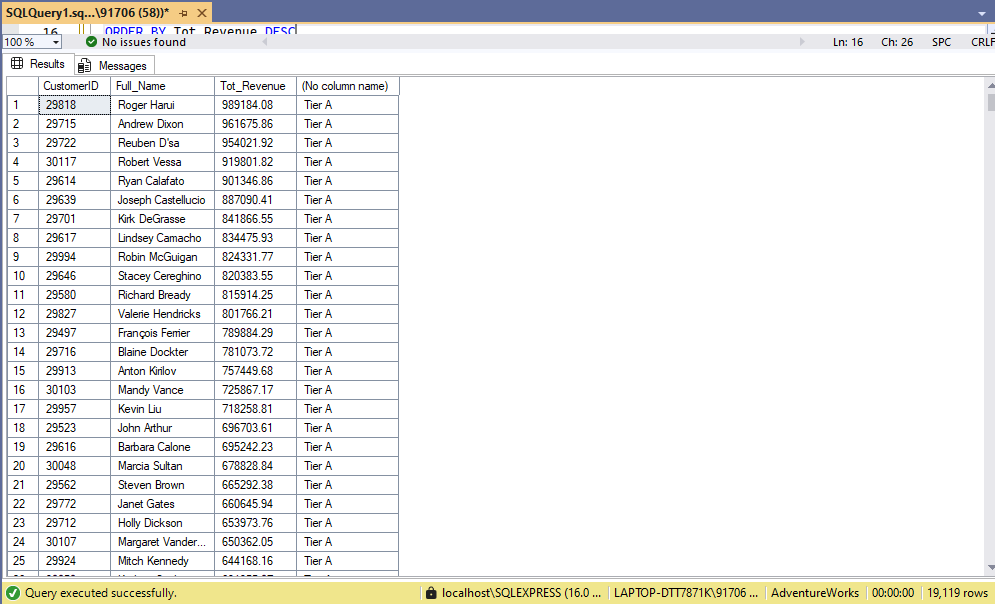
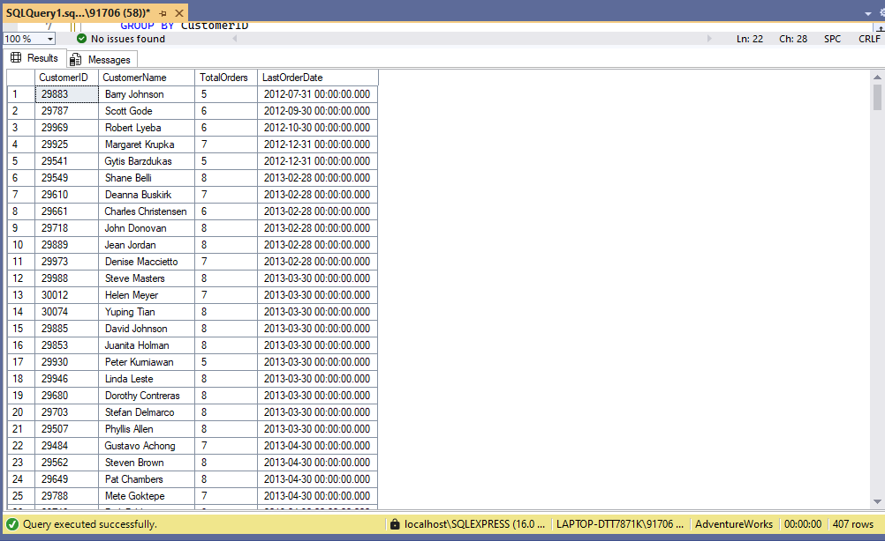
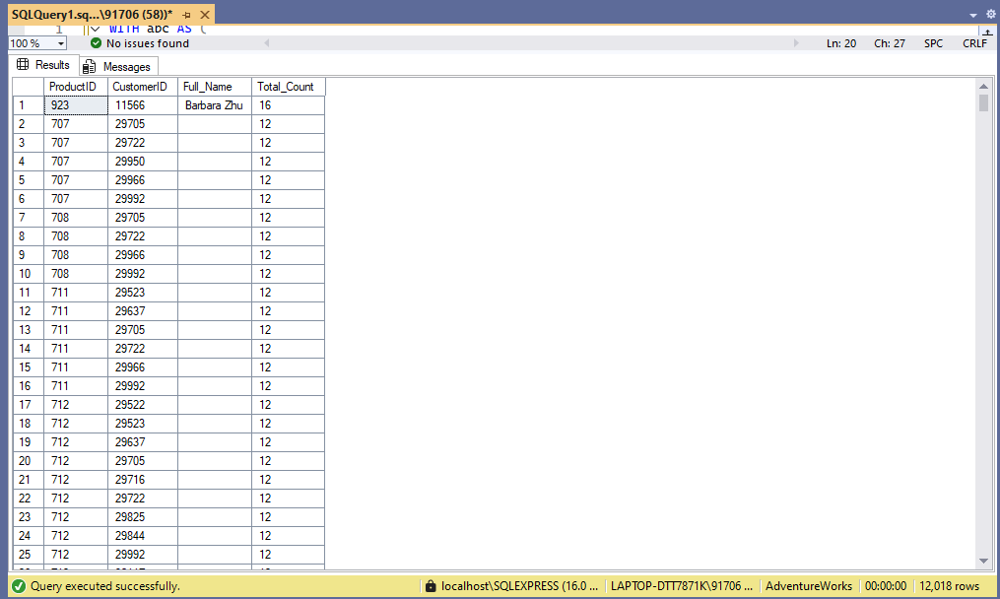

# AdventureWorks - Customer & Revenue Insights

This folder contains SQL queries and result snapshots from the **AdventureWorks** database project.  
The goal is to explore customer behavior, revenue trends, inactive users, and repeat purchases using real data.  
Each query is followed by insights derived from its results.

---

## 📂 Folder Structure
```
SQL PROJECT
│
└── AdventureWorks
    │
    └── 1.Customer_&_Revenue_Insights
        ├── 1.Top_Customers_by_Revenue.sql
        ├── 2.Customer_Lifetime_Value.sql
        ├── 3.Inactive_Customers.sql
        ├── 4.Repeat_Purchase_Analysis.sql
        ├── README.md
        │
        └── result_snapshots/
            ├── 1.Top_Customers_by_Revenue.png
            ├── 2.Customer_Lifetime_Value.png
            ├── 3.Inactive_Customers.png
            └── 4.Repeat_Purchase_Analysis.png
```
---

## 🧩 Queries Overview & Insights

### 1️⃣ Top Customers by Revenue
**File:** `1.Top_Customers_by_Revenue.sql`

**Description:**  
Lists customers with the highest total revenue. Helps identify top-performing and loyal customers contributing the most to business growth.

**Result Snapshot:**  


**Insights:**  
- Top customers like *Roger Harui*, *Andrew Dixon*, and *Reuben D’sa* have generated the highest revenue.  
- These customers fall under **Tier A**, meaning they are the business’s premium clients.  
- Revenue difference between the top 10 customers is narrow, showing consistent spending among high-value users.

---

### 2️⃣ Customer Lifetime Value
**File:** `2.Customer_Lifetime_Value.sql`

**Description:**  
Calculates each customer’s total lifetime revenue and groups them into tiers (A, B, or C) based on total value.

**Result Snapshot:**  


**Insights:**  
- **Tier A** customers dominate the revenue base and are critical for retention strategies.  
- A few customers show steady high-value purchases over time, proving long-term engagement.  
- The data can be used for tier-based loyalty programs or targeted marketing.

---

### 3️⃣ Inactive Customers
**File:** `3.Inactive_Customers.sql`

**Description:**  
Identifies customers who haven’t placed recent orders. This helps track potential churn and areas for customer re-engagement.

**Result Snapshot:**  


**Insights:**  
- Only a few customers (like *Dalton Perez* and *Luke Lal*) had activity before mid-2014 but haven’t returned since.  
- These customers can be targeted for **win-back campaigns**.  
- Highlights the importance of monitoring last order dates for retention.

---

### 4️⃣ Repeat Purchase Analysis
**File:** `4.Repeat_Purchase_Analysis.sql`

**Description:**  
Finds customers who bought the same product multiple times. This helps analyze customer loyalty and product popularity.

**Result Snapshot:**  


**Insights:**  
- *Morgan Jackson* and *Isabella Moore* have repeated purchases of the same product (Product ID 707) six times each.  
- Shows strong product satisfaction and potential for upselling similar items.  
- Repeat purchases help identify which SKUs build recurring revenue.

---

## 🗄️ Database Used
- **Database:** AdventureWorks  
- **Environment:** SQL Server  
- **Schema Used:** Sales, Customer, and Product tables  

---

## 🧠 Objective
The main goal of this analysis is to:
- Understand which customers drive the most revenue.  
- Identify inactive customers and potential churn risks.  
- Track repeat purchase behavior for loyalty insights.  
- Classify customers into tiers for better business strategy.

---

## ⚙️ Notes
- Queries are written and formatted in **VS Code**.  
- Executed against the AdventureWorks database through SQL Server.  
- Result snapshots were captured directly from **VS Code output**.  
- Each SQL file matches its respective result image for easy reference.

---

**Author:** Utkarsh N  
**Project:** SQL PROJECT → AdventureWorks → Customer & Revenue Insights  


