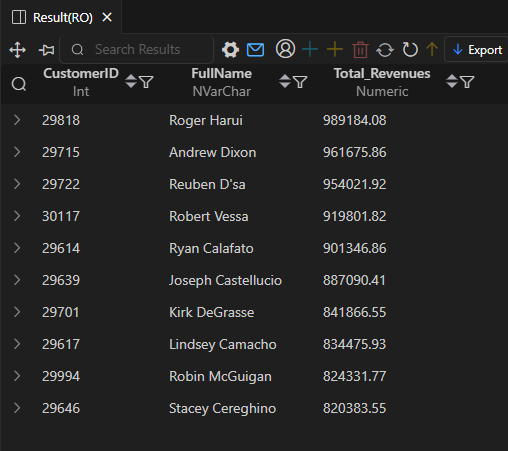
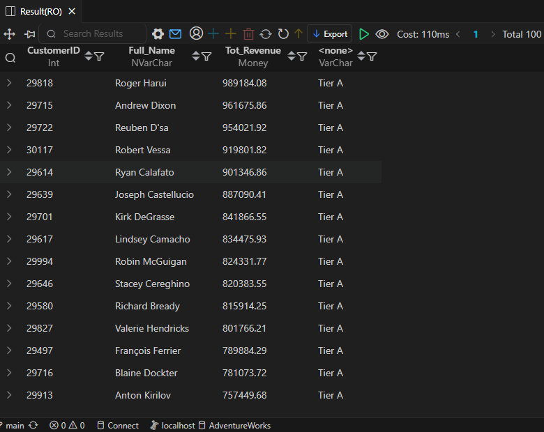

# AdventureWorks - Customer & Revenue Insights

This folder is part of the **SQL PROJECT → AdventureWorks** series.  
It focuses on analyzing customer revenue, spending patterns, inactivity, and repeat purchase behavior using SQL queries executed in **SSMS (SQL Server Management Studio)**.  
Each query is followed by insights based on the actual results.

---

## 📂 Folder Structure
```
SQL PROJECT
│
└── AdventureWorks
│
└── 1.Customer_&_Revenue_Insights
├── 1.Top_Customers_by_Revenue.sql
├── 2.Customer_Lifetime_Value.sql
├── 3.Inactive_Customers.sql
├── 4.Repeat_Purchase_Analysis.sql
├── README.md
│
└── result_snapshots/
├── 1.Top_Customers_by_Revenue.png
├── 2.Customer_Lifetime_Value.png
├── 3.Inactive_Customers.png
└── 4.Repeat_Purchase_Analysis.png
```


---

## 🧩 Queries & Insights

### 1️⃣ Top Customers by Revenue  
**File:** `1.Top_Customers_by_Revenue.sql`

**Description:**  
Lists the top customers ranked by total revenue.  
Helps identify high-value and loyal customers contributing the most to total sales.

**Result Snapshot:**  


**Insights:**  
- *Roger Harui*, *Andrew Dixon*, and *Reuben D’sa* are the top three revenue-generating customers.  
- Revenue among the top 10 is closely matched, showing consistent high-value behavior.  
- These customers form the **Tier A** group, representing the most profitable segment.  

---

### 2️⃣ Customer Lifetime Value  
**File:** `2.Customer_Lifetime_Value.sql`

**Description:**  
Calculates each customer’s total lifetime revenue and classifies them into revenue tiers (A, B, or C).  
Useful for segmentation and understanding contribution to overall revenue.

**Result Snapshot:**  


**Insights:**  
- Majority of high-value customers fall under **Tier A**.  
- Tier A customers like *Richard Bready*, *Valerie Hendricks*, and *François Ferrier* maintain steady contribution.  
- Tier grouping helps plan retention campaigns and premium service targeting.

---

### 3️⃣ Inactive Customers  
**File:** `3.Inactive_Customers.sql`

**Description:**  
Finds customers who have not placed any recent orders.  
Used to track potential churn and design reactivation strategies.

**Result Snapshot:**  


**Insights:**  
- Customers like *Barry Johnson*, *Scott Gode*, and *Robert Lyeba* had their last activity before 2014.  
- Such inactive customers can be targeted with re-engagement offers.  
- Monitoring last order dates helps maintain customer retention and reduce churn risk.

---

### 4️⃣ Repeat Purchase Analysis  
**File:** `4.Repeat_Purchase_Analysis.sql`

**Description:**  
Analyzes which customers have made repeat purchases of the same product.  
Helps identify loyal customers and frequently purchased products.

**Result Snapshot:**  


**Insights:**  
- Customers like *Barbara Zhu*, *Roger Harui*, and *Reuben D’sa* have purchased the same product multiple times.  
- *Product ID 707* appears most frequently, indicating strong customer preference.  
- Repeat purchase data helps spot popular products and loyal buyers.

---

## 🧠 Key Takeaways
- **Tier A customers** contribute the majority of total revenue.  
- Several long-term customers continue making purchases across years.  
- A portion of customers have become inactive and can be reactivated through targeted campaigns.  
- Repeat purchase analysis helps pinpoint product popularity and customer loyalty.

---

## 🗄️ Database Info
- **Database:** AdventureWorks  
- **Environment:** SQL Server (SSMS)  
- **Queries Written & Executed In:** SQL Server Management Studio  
- **Schemas Used:** Sales, Customer, and Product  

---

## ⚙️ Notes
- All queries were executed directly in **SSMS** using the AdventureWorks database.  
- Result screenshots were captured from the **SSMS output window**.  
- Each `.sql` file corresponds with one result image for easy reference.  
- Analysis covers customer segmentation, lifetime value, inactivity, and loyalty behavior.

---

**Author:** Utkarsh Naik   
**Project:** SQL PROJECT → AdventureWorks → Customer & Revenue Insights  
**Date:** 2025
