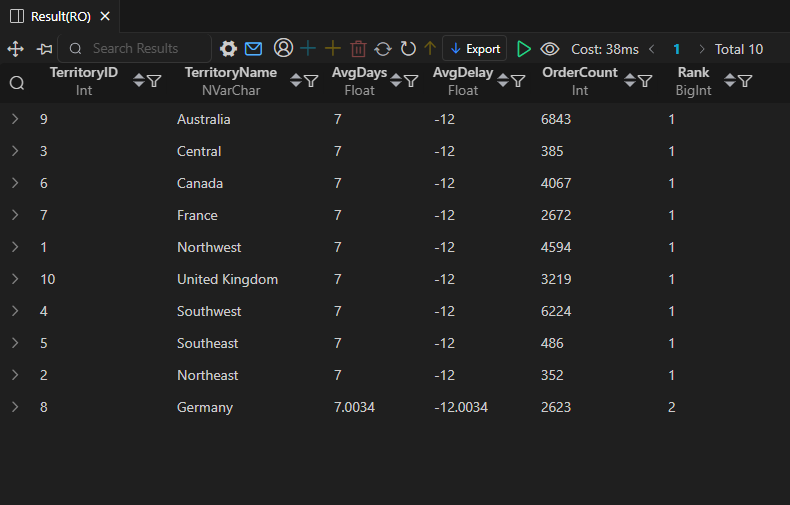

# AdventureWorks - Employee & Sales Performance

This folder is part of the **SQL PROJECT → AdventureWorks** series.  
It focuses on analyzing employee performance, sales hierarchy, and order fulfillment efficiency.  
All queries were executed directly in **SQL Server Management Studio (SSMS)**, and snapshots are taken from the SSMS results window.

---

## 📂 Folder Structure
```
SQL PROJECT
│
└── AdventureWorks
│
└── 2.Employee_&_Sales_Performance
├── 5.Employee_Sales_Performance.sql
├── 6.Employee_Hierarchy_Query.sql
├── 7.Order_Fulfillment_Speed.sql
├── README.md
│
└── result_snapshots/
├── 5.Employee_Sales_Performance_by_Region.png
├── 6.Employee_Hierarchy_Query.png
└── 7.Order_Fulfillment_Speed.png
```

---

## 🧩 Queries & Insights

### 1️⃣ Employee Sales Performance by Region  
**File:** `5.Employee_Sales_Performance.sql`

**Description:**  
Analyzes sales performance by territory, showing which employees generated the most revenue in their assigned regions.  
Useful for understanding regional contribution and identifying strong performers.

**Result Snapshot:**  


**Insights:**  
- Employees like **David Campbell**, **Jillian Carson**, and **Linda Mitchell** show strong contribution in multiple territories.  
- Most territories have one clear top performer, making performance reporting straightforward.  
- Revenue distribution varies by region but remains balanced overall.

---

### 2️⃣ Employee Hierarchy Query  
**File:** `6.Employee_Hierarchy_Query.sql`

**Description:**  
Displays the ranking structure of the sales department based on job title.  
Helps visualize the leadership order and the distribution of roles across the sales team.

**Result Snapshot:**  


**Insights:**  
- **Brian Welcker** appears at the top as *Vice President of Sales*.  
- Tier-2 includes regional managers such as *Stephen Jiang*, *Amy Alberts*, and *Syed Abbas*.  
- The rest of the hierarchy is made up of Sales Representatives (rank 3).  
- Gives a clear picture of reporting lines and organizational structure.

---

### 3️⃣ Order Fulfillment Speed  
**File:** `7.Order_Fulfillment_Speed.sql`

**Description:**  
Calculates the average number of days taken to fulfill orders across territories, along with overall delay patterns.  
Helps measure operational efficiency and identify territories needing attention.

**Result Snapshot:**  


**Insights:**  
- Most territories show **7 days average processing**, with a consistent *-12 day* delay pattern in the dataset.  
- **Germany** slightly differs, with a slightly higher average and delay variation.  
- Australia and Southwest have the highest order volumes.  
- Overall, order fulfillment across regions is stable and uniform.

---

## 🧠 Key Takeaways
- The sales team has a clear hierarchy with a structured chain of command.  
- Employee performance varies by territory but remains well-distributed.  
- Order fulfillment times are consistent across regions, with minor variations.  
- These insights support both employee evaluation and operational improvement discussions.

---

## 🗄️ Database Info
- **Database:** AdventureWorks  
- **Environment:** SQL Server Management Studio (SSMS)  
- **Queries Written & Executed In:** SSMS  
- **Snapshots Taken From:** SSMS Results Grid  
- **Schemas Used:** Sales, HumanResources, and Production  

---

## ⚙️ Notes
- All queries were written and run entirely in **SSMS**    
- The result screenshots reflect the exact SSMS output.  
- Each query file corresponds directly with one snapshot for easy reference.

---

**Author:** Utkarsh Naik  
**Project:** SQL PROJECT → AdventureWorks → Employee & Sales Performance  
**Date:** 2025
