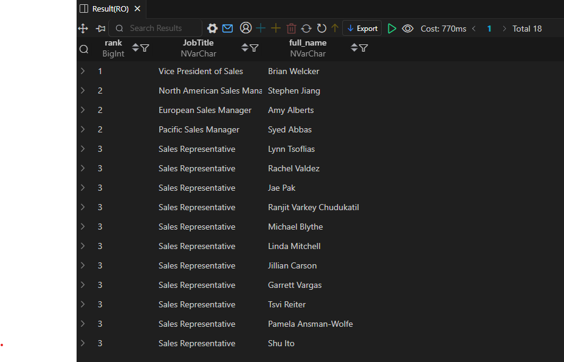

# AdventureWorks - Employee & Sales Performance

This folder is part of the **SQL PROJECT → AdventureWorks** series.  
It focuses on understanding employee hierarchy, sales performance by region, and order fulfillment efficiency.  
Each SQL file answers a specific question related to sales operations, and the result snapshots are included for visual reference.

---

## 📂 Folder Structure
```
SQL PROJECT
│
└── AdventureWorks
    │
    └── 2.Employee_&_Sales_Performance
        ├── 5.Employee_Sales_Performance.sql
        ├── 6.Employee_Hierarchy_Query.sql
        ├── 7.Order_Fulfillment_Speed.sql
        ├── README.md
        │
        └── result_snapshots/
            ├── 5.Employee_Sales_Performance_by_Region.png
            ├── 6.Employee_Hierarchy_Query.png
            └── 7.Order_Fulfillment_Speed.png
```
---


---

## 🧩 Queries & Insights

### 1️⃣ Employee Sales Performance by Region  
**File:** `5.Employee_Sales_Performance.sql`

**Description:**  
Analyzes sales revenue generated by each employee across territories.  
Ranks salespersons based on total revenue within their assigned regions.

**Result Snapshot:**  


**Insights:**  
- *Jae Pak*, *Linda Mitchell*, and *Tsvi Reiter* are among the top performers across multiple territories.  
- Revenue contribution is balanced across regions, showing a healthy distribution of sales efforts.  
- Regional performance can be used to identify best practices and recognize top-performing employees.

---

### 2️⃣ Employee Hierarchy Query  
**File:** `6.Employee_Hierarchy_Query.sql`

**Description:**  
Displays the hierarchy structure of the sales department using ranking logic.  
Helps visualize leadership roles and reporting lines within the sales organization.

**Result Snapshot:**  


**Insights:**  
- *Brian Welcker* holds the top position as **Vice President of Sales**.  
- Regional managers like *Stephen Jiang*, *Amy Alberts*, and *Syed Abbas* represent tier-2 leadership.  
- Sales Representatives form the foundation of the sales structure, distributed evenly across territories.  
- This hierarchy view is useful for reporting, performance tracking, and role-based analysis.

---

### 3️⃣ Order Fulfillment Speed  
**File:** `7.Order_Fulfillment_Speed.sql`

**Description:**  
Calculates the average order processing and delivery time by sales territory.  
Used to monitor fulfillment performance and identify delays or efficiency gaps.

**Result Snapshot:**  


**Insights:**  
- Most territories have an average delivery cycle of **7 days**, with minimal delay variation.  
- *Germany* shows a slightly longer processing time compared to other regions.  
- Overall consistency indicates well-managed logistics and streamlined order operations.  
- Useful for identifying areas that may require process optimization or support.

---

## 🧠 Key Takeaways
- Sales operations are distributed evenly across multiple regions with strong employee performance.  
- The organization maintains a clear hierarchical structure supporting efficient communication.  
- Order fulfillment metrics show stable delivery performance with minor regional differences.  
- The data supports both performance evaluation and operational improvement decisions.

---

## 🗄️ Database Info
- **Database:** AdventureWorks  
- **Environment:** SSMS (SQL Server Management Studio)  
- **Queries Written In:** Visual Studio Code  
- **Snapshots Taken From:** VS Code SQL Output  
- **Schemas Used:** Sales, HumanResources, and Production  

---

## ⚙️ Notes
- Queries are written and formatted in **VS Code**.  
- All results were executed and tested on the AdventureWorks database through SQL Server.  
- Snapshots were captured directly from **VS Code output**.  
- Each SQL file matches its respective snapshot for easy tracking.

---

**Author:** Utkarsh Naik   
**Project:** SQL PROJECT → AdventureWorks → Employee & Sales Performance  
**Date:** 2025
