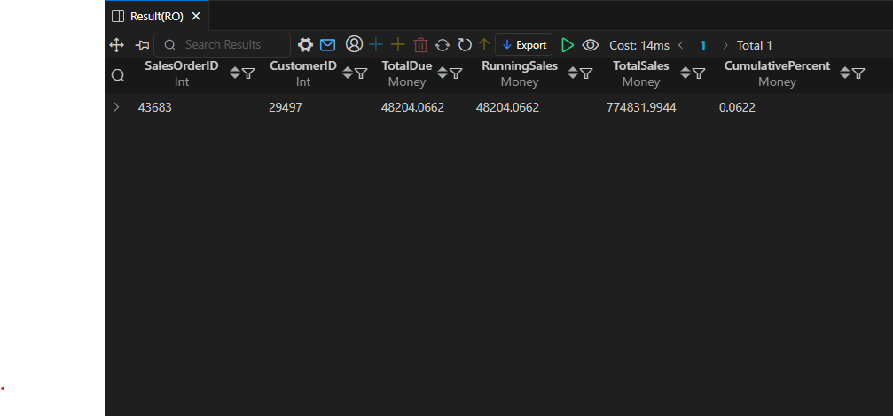
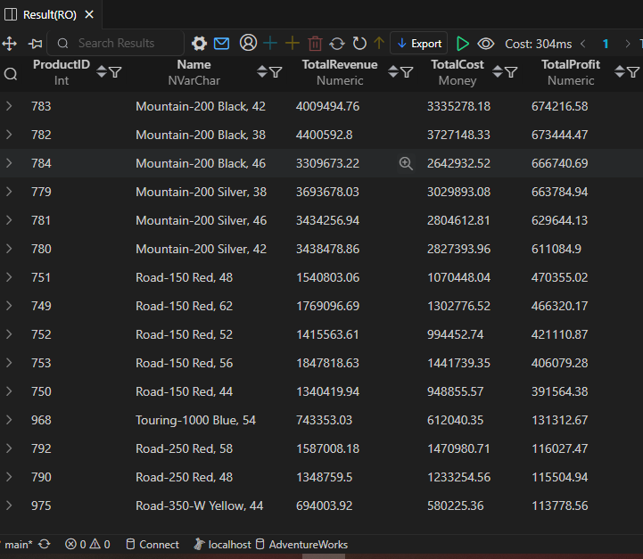
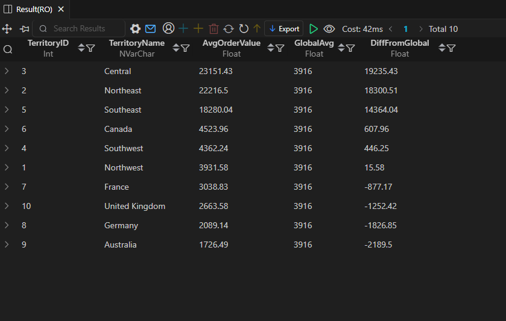

# AdventureWorks - Order & Profitability Analysis

This folder is part of the **SQL PROJECT → AdventureWorks** series.  
It focuses on analyzing high-value orders, product profitability, and average order value across sales territories.  
All SQL queries were executed in **SQL Server Management Studio (SSMS)** and the result snapshots were captured directly from the SSMS results window.

---

## 📂 Folder Structure
```
SQL PROJECT
│
└── AdventureWorks
│
└── 3.Order_&_Profitability_Analysis
├── 8.High_Value_Orders.sql
├── 9.Profitability_by_Product.sql
├── 10.Average_Order_Value_by_Region.sql
├── README.md
│
└── result_snapshots/
├── 8.High-Value_Orders.png
├── 9.Profitability_by_Product.png
└── 10.Average_Order_Value_by_Region.png
```

---

## 🧩 Queries & Insights

### 1️⃣ High-Value Orders  
**File:** `8.High_Value_Orders.sql`

**Description:**  
Identifies the highest-value customer orders and calculates running totals, cumulative sales, and each order’s contribution to total revenue.

**Result Snapshot:**  


**Insights:**  
- Large orders make up a significant share of total sales — classic **Pareto behaviour**.  
- The top few orders add up quickly and heavily push total revenue upward.  
- Helps flag high-value customers and opportunities for upselling, premium service, or targeted offers.

---

### 2️⃣ Profitability by Product  
**File:** `9.Profitability_by_Product.sql`

**Description:**  
Calculates total revenue, cost, and resulting profit for each product.  
Useful for understanding which items bring the highest margin.

**Result Snapshot:**  


**Insights:**  
- The **Mountain-200 Black / Silver** models consistently appear in the top profitable products.  
- Road-150 and Road-250 variants also show strong revenue and margin.  
- High-end products clearly dominate profit contribution.  
- Lower-margin SKUs may require pricing review or cost reduction.

---

### 3️⃣ Average Order Value by Region  
**File:** `10.Average_Order_Value_by_Region.sql`

**Description:**  
Calculates the **Average Order Value (AOV)** for each territory and compares it with the global average.

**Result Snapshot:**  


**Insights:**  
- **Central**, **Northeast**, and **Southeast** have very high AOV compared to global average.  
- **Australia** and **Germany** show lower AOV, indicating weaker spending behaviour in those regions.  
- The big positive difference in some regions suggests strong domestic or regional demand.  
- Helps guide region-specific pricing or promotional strategies.

---

## 🧠 Key Takeaways
- High-value orders are crucial for total sales and should be monitored closely.  
- Profitability is heavily driven by premium bike models, especially the Mountain-200 series.  
- Strong variation in AOV across territories indicates clear regional behaviour patterns.  
- These insights support strategic decisions in pricing, inventory planning, and regional marketing.

---

## 🗄️ Database Info
- **Database:** AdventureWorks  
- **Environment:** SQL Server Management Studio (SSMS)  
- **Queries Written & Executed In:** SSMS  
- **Snapshots Taken From:** SSMS Results Grid  
- **Schemas Used:** Sales, Production  

---

## ⚙️ Notes
- All SQL queries were run directly in **SSMS**, not VS Code.  
- Snapshots and numbers reflect the exact SSMS output.  
- Each `.sql` file corresponds directly with its own result screenshot inside the folder.

---

**Author:** Utkarsh Naik  
**Project:** SQL PROJECT → AdventureWorks → Order & Profitability Analysis  
**Date:** 2025
