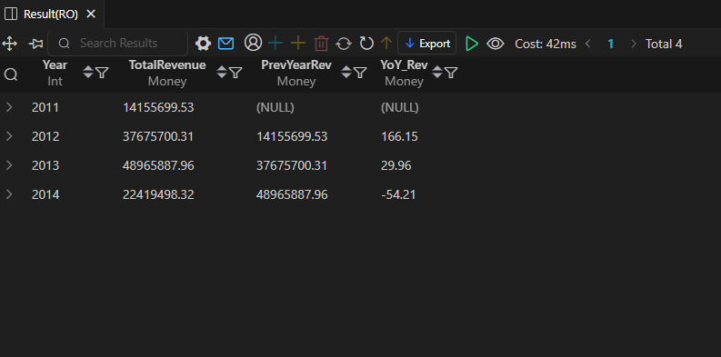
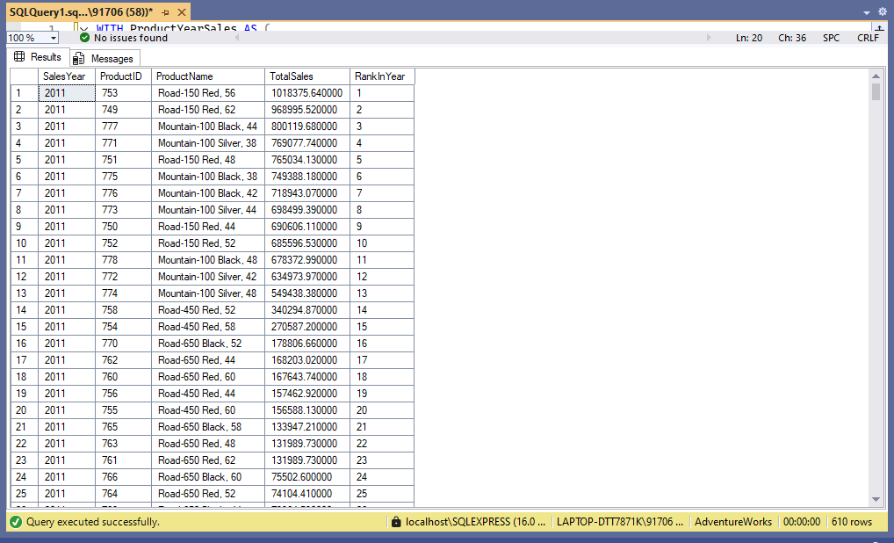
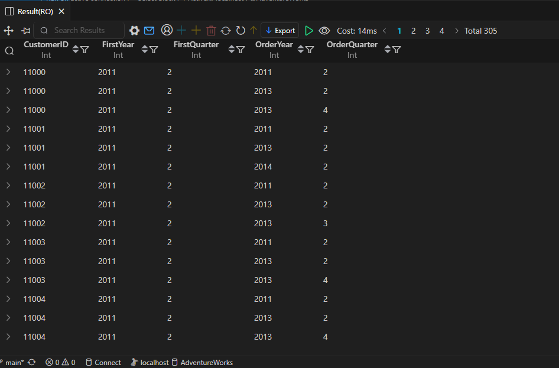

# AdventureWorks - Trends & Growth

This folder is part of the **SQL PROJECT → AdventureWorks** series.  
It focuses on analyzing sales trends, revenue growth patterns, and customer retention behavior over multiple years.  
Each query highlights how sales performance evolved and which products or customers contributed most to growth.

---

## 📂 Folder Structure
```
SQL PROJECT
│
└── AdventureWorks
    │
    └── 4.Trends_&_Growth
        ├── 11.Sales_Trend_Analysis.sql
        ├── 12.Dynamic_Ranking.sql
        ├── 13.Quarterly_Cohort_Retention.sql
        ├── README.md
        │
        └── result_snapshots/
            ├── 11.Sales_Trend_Analysis.png
            ├── 12.Dynamic_Ranking.png
            └── 13.Quarterly_Cohort_Retention.png
```
---

## 🧩 Queries & Insights

### 1️⃣ Sales Trend Analysis  
**File:** `11.Sales_Trend_Analysis.sql`

**Description:**  
Analyzes yearly sales performance to understand revenue growth and decline trends.  
Compares year-over-year (YoY) changes in total revenue to identify strong and weak performance periods.

**Result Snapshot:**  


**Insights:**  
- Revenue peaked in **2013**, showing a **29.96% YoY growth** over 2012.  
- The largest growth occurred between **2011 → 2012** (+166.15%), suggesting a strong expansion phase.  
- However, **2014** saw a **-54.21% decline**, which indicates a drop in demand or reduced sales volume.  
- The trend highlights the need for steady customer acquisition and consistent product strategy.

---

### 2️⃣ Dynamic Ranking  
**File:** `12.Dynamic_Ranking.sql`

**Description:**  
Ranks products dynamically by total sales within each year to track how top-selling items change over time.

**Result Snapshot:**  


**Insights:**  
- In **2011**, *Road-150 Red, 56* led the sales charts, followed by *Mountain-100 Black, 42*.  
- In **2012**, the *Mountain-200 Black, 42* overtook others, becoming the top product for the year.  
- Ranking patterns show shifting customer preferences from road bikes to mountain models.  
- Helps track evolving product performance and plan future inventory or marketing focus.

---

### 3️⃣ Quarterly Cohort Retention  
**File:** `13.Quarterly_Cohort_Retention.sql`

**Description:**  
Tracks how customer cohorts from specific quarters continue to place orders in later years.  
Useful for retention analysis and understanding long-term customer engagement.

**Result Snapshot:**  


**Insights:**  
- Customers who first purchased in **2011 Q2** continued to place orders up to **2014**, showing good retention.  
- Several repeat orders are observed in consistent quarterly intervals.  
- Indicates that early customers from 2011 and 2012 form a loyal segment with regular purchase cycles.  
- Valuable for retention marketing and loyalty-based strategy.

---

## 🧠 Key Takeaways
- Sales grew strongly between **2011–2013**, before slowing down in **2014**.  
- Product rankings shifted over time — mountain bikes replaced road models as top performers.  
- Customer retention remained healthy, especially for early cohorts.  
- These insights provide a clear view of **growth drivers**, **market trends**, and **loyal customer behavior**.

---

## 🗄️ Database Info
- **Database:** AdventureWorks  
- **Environment:** SSMS (SQL Server Management Studio)  
- **Queries Written In:** Visual Studio Code  
- **Snapshots Taken From:** VS Code SQL Output  
- **Schemas Used:** Sales, Production, Customer  

---

## ⚙️ Notes
- Queries are created and formatted in **VS Code**.  
- All results are executed and verified in **SSMS**, connected to the AdventureWorks database.  
- Snapshots were captured directly from VS Code output after execution.  
- Each `.sql` file has a matching result image for clarity.

---

**Author:** Utkarsh Naik  
**Project:** SQL PROJECT → AdventureWorks → Trends & Growth  
**Date:** 2025
