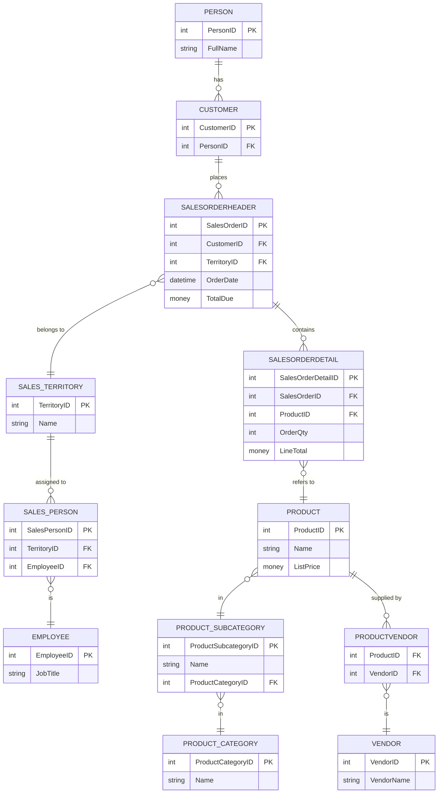

# AdventureWorks SQL Analysis

This folder contains a complete SQL analysis project built on the **AdventureWorks** database.  
Across multiple sections, the project covers customer behavior, employee performance, product insights, profitability, and long-term trends.  
All analysis was done using **SQL Server Management Studio (SSMS)**, and each section includes the SQL scripts along with result snapshots from SSMS.

The goal of this project is to understand different aspects of the AdventureWorks business using SQL alone, without external tools.

---

## Schema Diagram  

---
## 📂 Folder Structure
```
SQL PROJECT
│
└── 3.AdventureWorks
│
├── 1.Customer_&Revenue_Insights
├── 2.Employee&Sales_Performance
├── 3.Order&Profitability_Analysis
├── 4.Trends&Growth
└── 5.Product&_Market_Insights
```

Each folder contains:
- `.sql` files for all queries
- A `README.md` explaining the logic and insights
- A `result_snapshots` folder with SSMS screenshots

---

## 📘 Sections Overview

### **1️⃣ Customer & Revenue Insights**
Focus on customer behavior:
- Top revenue customers  
- Customer lifetime value  
- Inactive customers  
- Repeat purchase patterns  

This helps in segmentation, retention planning, and identifying loyal customers.

---

### **2️⃣ Employee & Sales Performance**
Covers internal performance and operations:
- Sales by employee across regions  
- Sales hierarchy structure  
- Order fulfillment speed  

Useful for tracking performance and improving operations.

---

### **3️⃣ Order & Profitability Analysis**
Deep dive into sales patterns:
- High-value orders  
- Product profitability  
- Average order value by region  

Helps identify profit drivers and regional performance differences.

---

### **4️⃣ Trends & Growth**
Long-term analysis:
- Year-over-year revenue trends  
- Product ranking trends by year  
- Quarterly customer retention  

Shows how the business evolved across years.

---

### **5️⃣ Product & Market Insights**
Product and market behavior:
- Frequently bought together items  
- Top customers by product category  
- Regional product preferences  
- Top suppliers  

Useful for merchandising, marketing, and vendor evaluation.

---

## 🛠️ Tools & Environment

- **Database:** AdventureWorks  
- **Platform:** SQL Server  
- **Environment:** SQL Server Management Studio (SSMS)  
- **Snapshots:** Captured directly from SSMS Results Grid  
- **Languages Used:** T-SQL  

---

## 🎯 Project Purpose

The main objectives of this SQL project are:
- To practice real-world SQL scenarios  
- To understand business behavior using only SQL queries  
- To simulate the analysis a data analyst would perform in a professional environment  
- To organize the work in a clean, structured, and reviewable format suitable for GitHub  

---

## ✍️ Author

**Utkarsh Naik**  
SQL Analysis • Data Analytics Journey • 2025

---

## 📎 Notes

- Each folder is self-contained and can be reviewed independently.  
- All SQL queries are original and executed directly in SSMS.  
- Screenshots reflect exact output from the database without modifications.  

