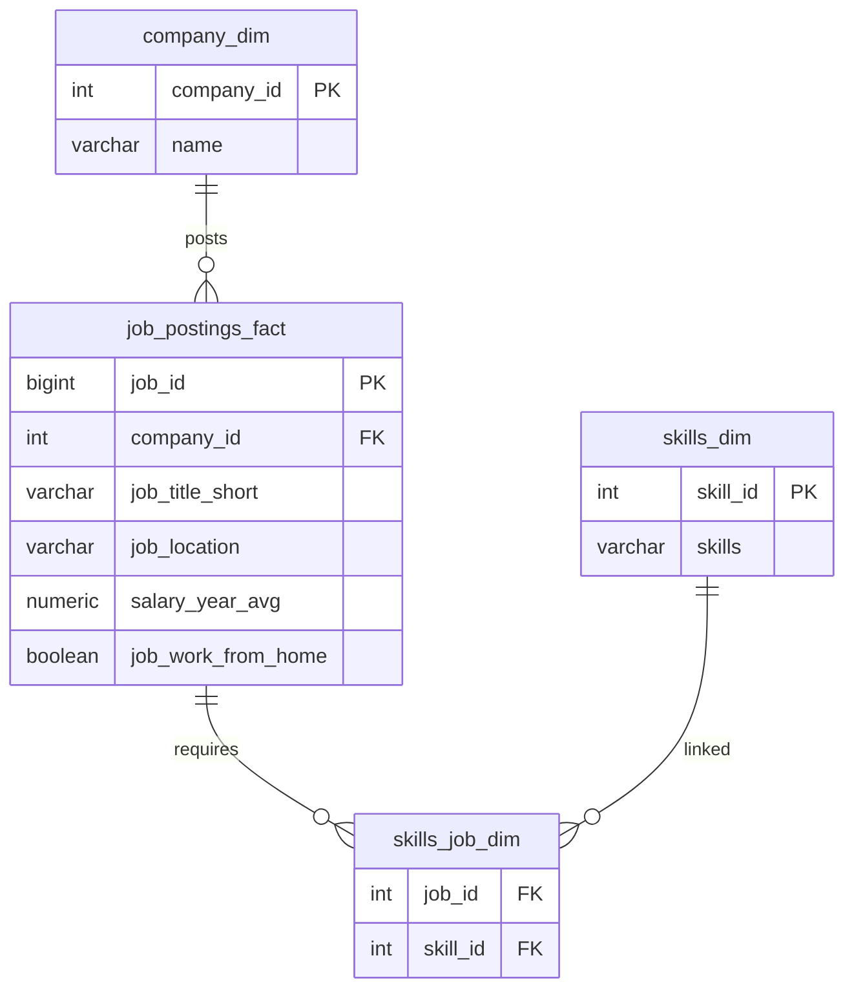

## Job Data Analysis – SQL Portfolio Project  
--- 

## Overview  
This project explores job market data for **Data Analyst roles** using SQL.  
The goal is to answer business-relevant questions such as:  
- What are the top-paying jobs?  
- Which skills are most in-demand?  
- What skills are both in-demand and high-paying?  
- How do specific salaries compare to the average?  

Each query is stored in its own folder with:  
-  `query.sql` – the SQL code  
-  `README.md` – explanation of the question, approach, and insights  
-  `result.png` – screenshot of the results  

---

## Queries Covered  

1. **Top-Paying Jobs** → Highest salaries for Data Analysts.  
2. **Skills for Top-Paying Jobs** → Skills required for the highest-paying roles.  
3. **Top Remote Skills** → Most in-demand skills for remote Data Analyst jobs.  
4. **Skills Ranked by Salary** → Average salary associated with each skill.  
5. **Optimal Skills to Learn** → Skills that are both in high demand and high paying.  
6. **Salary vs Average Comparison** → Compare specific job salaries with role averages.  

---

## Tech Stack  
- **SQL** :PostgreSQL 
- **Dataset**: The dataset was collected from an open online source and contains job postings data with details on job roles, companies, salaries, and required skills. 
- **Visualization**: Screenshots of query results  

---
## Schema Diagram

---

## SQL Skills Demonstrated
- Filtering & ordering (Query 1)
- CTEs (Query 2 & 5)
- Aggregations & GROUP BY (Query 3 & 4)
- Window functions (Query 6)
- Combining demand & salary insights (Query 5)

---

## Why This Project Matters  
This project demonstrates:  
- Strong **SQL query skills** (joins, CTEs, window functions, aggregation).  
- Ability to **extract business insights** from raw job postings data.  
- Professional **GitHub project structure** for easy readability.  
